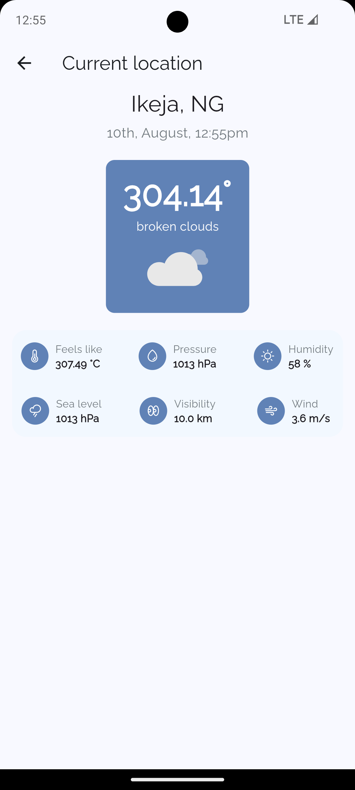

# Renmoney Flutter Engineer Assessment

## View Application

1. Find the apk file on this google drive link [here](https://drive.google.com/drive/folders/12nk7y3vc6M3ZW1uepBAm8se2JzCIRaw6?usp=sharing) 

## Installation

1. Make sure you have [Flutter](https://flutter.dev/docs/get-started/install) and its dependencies installed on your device.
2. Clone the repository: `git clone https://github.com/yourusername/my-app.git`
3. Go to the project directory: `cd my-app`
4. Run `flutter pub get` to install the dependencies.
5. Run `flutter run` to start the app on an emulator or connected device.

## User Interface
The application features the design principle "Component Driven Design" which enables a clean and user-friendly interface, with widgets broken down into several "Components", then components into "Atoms", following the DRY principle to enable easier code maitenance and readability.

## Technical details
- The weeather app is built with Flutter UI toolkit, written with the Dart programming language.
- The app uses "shared_prefrences" for persistent storage of marked weathers.
- It demonstrates remote data fetching from an API.
- The major state management used is Riverpod & Flutter Hooks.
- They are based on the  a declarative programming paradigm and embraces the concepts of reactive programming and functional programming.
- The app intends to follows functional, object oriented and reactive paradigms.

## Feature Interface (Demo)
- [x] Homepage
- [x] Favorite cities page
- [x] Current location page
- [x] Homepage (with added favorite)

## Screenshots

| Homepage | Add favorite city page | 
|    :---:     |     :---:      |  
|    |    |

| User location forecast page  | Persisted favorite page  | 
|    :---:     |     :---:      |  
|    |    |
